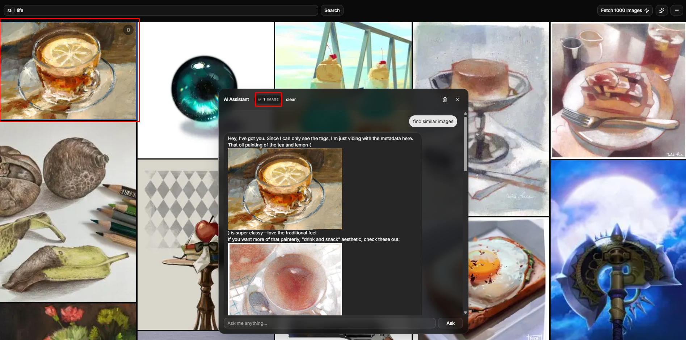

# AI Image Search

AI powered image browser for Gelbooru with integrated Google Gemini AI.



## Highlights
* **Smart Grid:** Masonry layout that balances images by aspect ratio with infinite scroll.
* **AI Assistant:** Powered by the **Gemini API**, the chatbot sees the entire context of the page and knows which images you have selected.
* **Architecture:** Built with Next.js, using **Zustand** for state management and **Prisma** to store the filters, blacklist, and search history.

## Getting Started

### Prerequisites
* Node.js 18+
* PostgreSQL database
* [Gelbooru API Account](https://gelbooru.com/) (`api_key` & `user_id`)
* [Google Gemini API Key](https://aistudio.google.com/apikey)

### Installation

1. **Clone & Install**
   ```bash
   git clone https://github.com/ItzKoTiK/ai-image-search.git
   cd ai-image-search
   npm install
   ```

2. **Environment Variables**
   ```bash
   cp .env.example .env
   # Add your database URL and API keys to .env
   ```

3. **Database Setup**
   ```bash
   npx prisma generate
   npx prisma db push
   ```

4. **Run the App**
   ```bash
   npm run dev
   ```
   Open [http://localhost:3000](http://localhost:3000) to see the app.

## Usage
* **Search:** Type tags in the top search bar. The URL updates automatically (`/?tags=...`).
* **Bulk Fetch:** Click the lightning bolt icon to load 1000 images at once.
* **Chat:** Click the sparkles icon to open the AI assistant. Select images in the grid to provide context to the AI.
* **Settings:** Open the right drawer to toggle themes, change AI models, or edit your SFW/blacklist preferences.

## License
MIT
